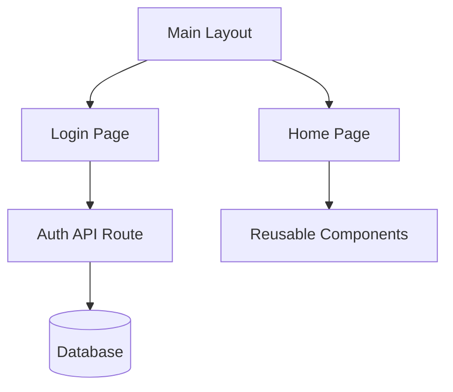

# Generating Project Flowchart with ChatGPT

This guide explains how to use ChatGPT to generate a flowchart for the Dropl project.

## Project Structure Overview

The project follows a modern Next.js application structure with the following main components:

- `/app` - Next.js app directory containing pages and layouts
- `/components` - Reusable UI components
- `/utils` - Utility functions and helpers
- `/lib` - Core library code and configurations
- `/Schema` - Database schema definitions
- `/drizzle` - Database migrations and configurations

## How to Generate Flowchart

1. **Initial Prompt**
   Use this prompt with ChatGPT:
   ```
   Please create a flowchart for a Next.js application with the following structure:
   - App directory structure
   - Component hierarchy
   - Data flow
   - Authentication flow
   - Database interactions
   ```

2. **Follow-up Prompts**
   After getting the initial flowchart, you can use these follow-up prompts to refine it:
   ```
   - Can you add more detail about the authentication flow?
   - Please explain the data flow between components
   - Show the relationship between the database and API routes
   ```

3. **Flowchart Format**
   Request the flowchart in one of these formats:
   - Mermaid syntax (recommended for GitHub)
   - PlantUML
   - ASCII art
   - Draw.io compatible format

## Key Areas to Include

1. **Authentication Flow**
   - User registration
   - Login process
   - Session management
   - Protected routes

2. **Data Flow**
   - API routes
   - Database operations
   - State management
   - Component communication

3. **Component Hierarchy**
   - Layout components
   - Page components
   - Reusable UI components
   - Form components

4. **Database Interactions**
   - Schema relationships
   - CRUD operations
   - Migration flow

## Example Mermaid Syntax

Here's an example of how to request Mermaid syntax from ChatGPT:

```
Please generate a flowchart using Mermaid syntax that shows:
1. The main application flow
2. Component hierarchy
3. Data flow between components
4. Database interactions

Use the following structure:
- Start with the main layout
- Show page routing
- Include authentication flow
- Display database operations
```

## Tips for Better Results

1. **Be Specific**
   - Mention specific components or features you want to highlight
   - Reference actual file names and paths
   - Include specific database tables or schemas

2. **Iterative Refinement**
   - Start with a high-level overview
   - Add details in subsequent prompts
   - Focus on specific areas that need more detail

3. **Format Considerations**
   - Specify the desired output format
   - Mention any specific tools you'll use to render the flowchart
   - Consider the level of detail needed

4. **Validation**
   - Verify the flowchart against the actual codebase
   - Check for missing connections or components
   - Ensure the flow matches the implementation

## Example ChatGPT Prompts

1. **High-level Overview**
   ```
   Create a high-level flowchart showing the main components and their interactions in this Next.js application.
   ```

2. **Detailed Component Flow**
   ```
   Generate a detailed flowchart focusing on the component hierarchy and data flow between components.
   ```

3. **Authentication Flow**
   ```
   Create a flowchart specifically for the authentication process, including registration, login, and session management.
   ```

4. **Database Operations**
   ```
   Show a flowchart of all database operations, including CRUD operations and their relationships with API routes.
   ```

## Suggested Enhancements

### 1. Visual Flowchart Example
Here's a basic Mermaid syntax flowchart to give you a quick visual reference:



### 2. Quick Reference Table

| Prompt Type | Purpose |
|-------------|---------|
| High-level overview | Visualize core structure and relationships |
| Component hierarchy | Understand UI composition and layout |
| Authentication flow | Map registration, login, and session handling |
| Database operations | Show how schema, migrations, and queries are connected to the backend |

### 3. Tools for Rendering Flowcharts

Here are some recommended tools for rendering your flowcharts:

- **Mermaid Live Editor**: https://mermaid.live
- **VSCode + Mermaid plugin**
- **Draw.io** for visual editing
- **Obsidian, Notion, or GitHub Markdown** rendering

### 4. Common Mistakes to Avoid

When creating flowcharts, be careful to avoid these common pitfalls:

- Forgetting to include protected route logic in auth flow
- Missing connections between API routes and database functions
- Ignoring shared state or props in component data flow
- Not showing error handling paths
- Omitting loading states and transitions

### 5. Flowchart Complexity Levels

Consider creating flowcharts at different levels of detail:

1. **Level 1: High-level Overview**
   - Main application structure
   - Core features
   - Basic data flow

2. **Level 2: Mid-level Detail**
   - Authentication flow
   - Data flow
   - Component relationships

3. **Level 3: Low-level Detail**
   - Component file-to-file interactions
   - CRUD operation breakdowns
   - State management details

### 6. Versioning and Maintenance

💡 **Versioning Tips:**
- Store flowcharts in your documentation repository
- Version your flowcharts to track architectural changes
- Update flowcharts when making significant changes to the codebase
- Include a changelog for major flowchart updates
- Consider using a dedicated flowchart management tool

Remember to save the generated flowchart in an appropriate format and update it as the project evolves. 